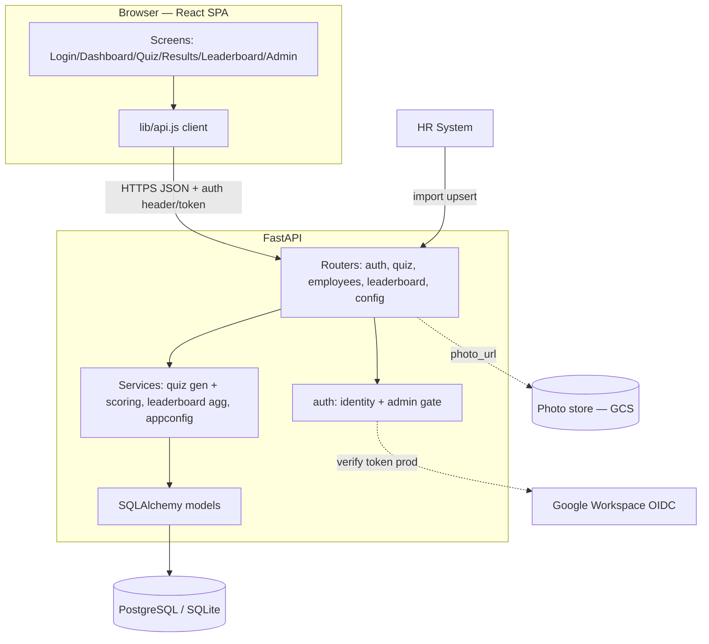
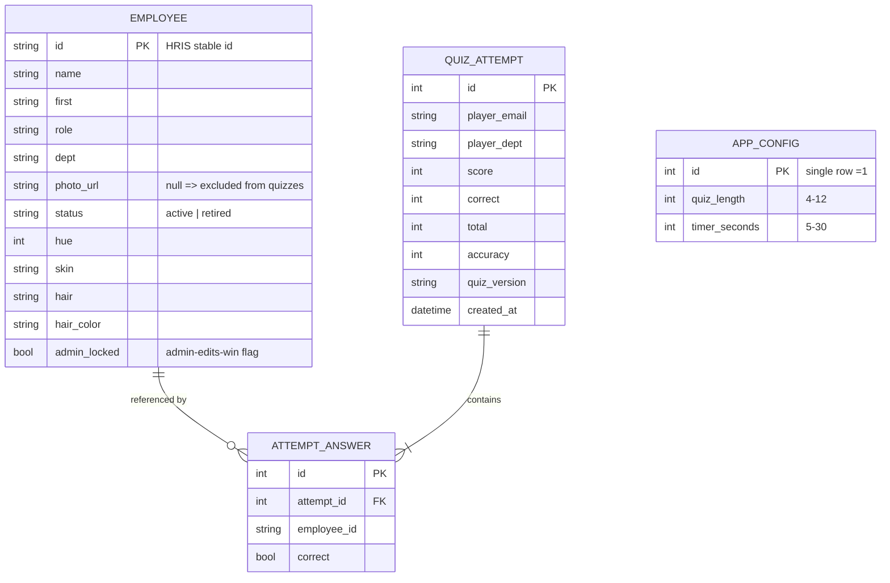
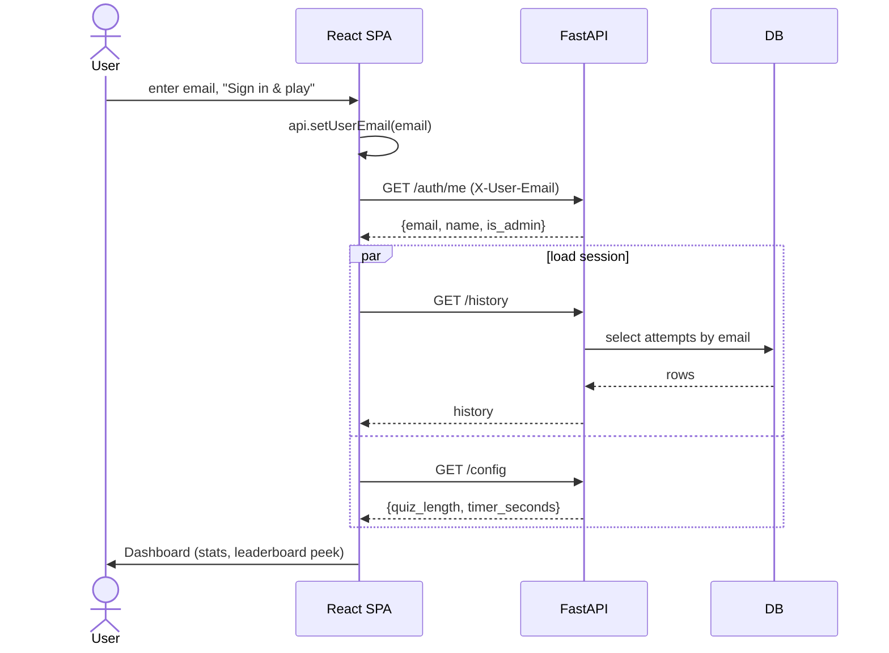
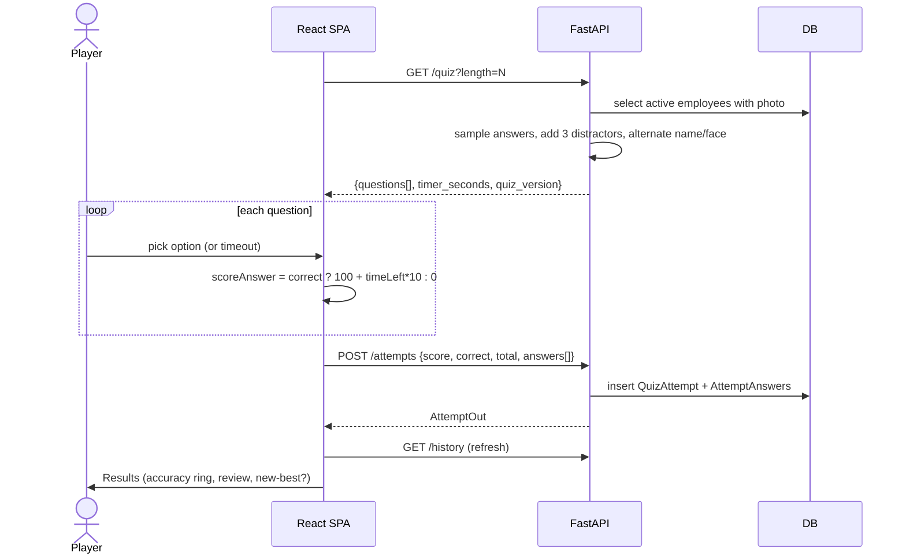
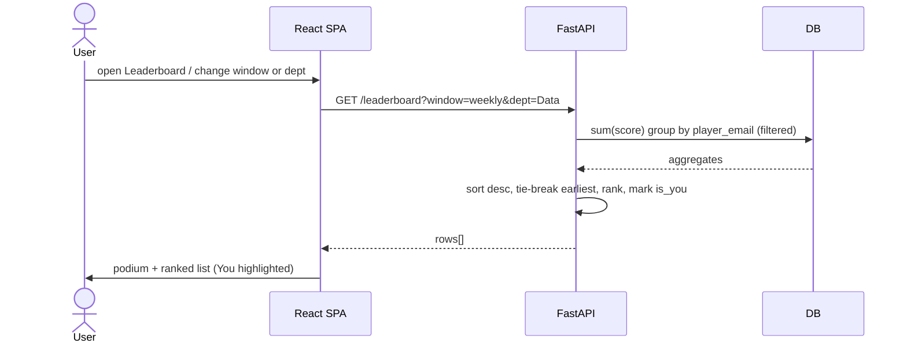
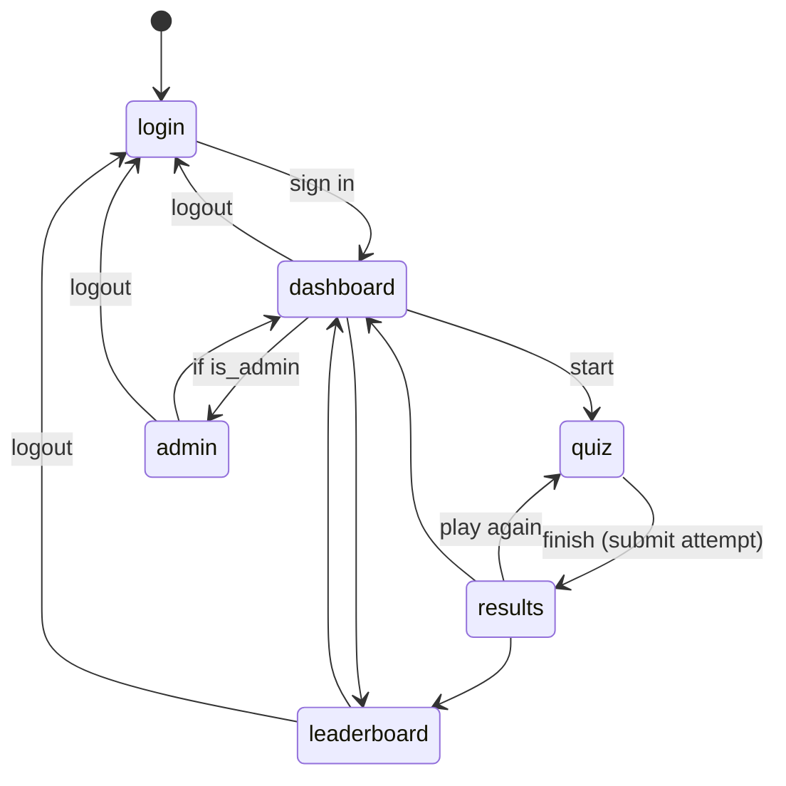

# Architecture — NameFaces Quiz

How the app is built. Reflects the current implementation in `frontend/` and `backend/`.

| Field | Value |
|---|---|
| Doc version | 1.0 |
| Status | As-built (MVP) |
| Related | [PRD.md](PRD.md) · [DESIGN_SPEC.md](design/DESIGN_SPEC.md) · [DEPLOYMENT.md](DEPLOYMENT.md) |

---

## 1. Stack (as implemented)

| Layer | Tech | Notes |
|---|---|---|
| Frontend | React 18 + Vite 5 (JavaScript) | SPA, screen-state navigation (no router lib) |
| Styling | Plain CSS + oklch design tokens | 3 themes; Fredoka + Nunito fonts |
| Backend | Python 3.9+ · FastAPI | Pydantic v2 I/O, SQLAlchemy 2.0 ORM |
| Database | SQLite (dev) / PostgreSQL (prod) | Same ORM; driver swap via `DATABASE_URL` |
| Photo storage | Local placeholder (dev) / GCS (prod) | `photo_url` on Employee |
| Auth | Dev header stub → Google Workspace OIDC (prod) | role from `ADMIN_EMAILS` → Workspace groups |
| Hosting | GCP (target) | Cloud Run + Cloud SQL + GCS |

## 2. Repo layout

```
namefaces/
├── docs/                 # PRD, design spec, architecture, deployment
│   └── design/           # hifi handoff + extracted spec
├── frontend/             # React + Vite SPA
│   └── src/
│       ├── App.jsx           # screen-state shell + session orchestration
│       ├── lib/              # api client, scoring/stats helpers
│       ├── components/       # Avatar, TopBar
│       └── screens/          # Login, Dashboard, Quiz, Results, Leaderboard, Admin
└── backend/              # FastAPI
    └── app/
        ├── main.py          # app, CORS, router wiring, startup seed
        ├── config.py        # env settings
        ├── db.py            # engine/session/Base
        ├── models.py        # Employee, AppConfig, QuizAttempt, AttemptAnswer
        ├── schemas.py       # Pydantic models
        ├── auth.py          # dev auth stub + admin gate
        ├── seed.py          # demo employees + attempts
        ├── services/        # quiz, leaderboard, appconfig
        └── routers/         # auth, quiz, employees, leaderboard, config
```

## 3. System architecture



## 4. Data model



- **Leaderboard** is not a table — it is aggregated on demand from `QUIZ_ATTEMPT` (sum score per `player_email`, tie-break earliest `created_at`).
- **Quizzable rule:** an employee appears in quizzes only when `status == active` AND `photo_url` is set.

## 5. API surface

| Method | Path | Auth | Purpose |
|---|---|---|---|
| GET | `/health` | — | liveness |
| GET | `/auth/me` | user | current identity + `is_admin` |
| GET | `/quiz?length=` | user | generate quiz (name/face rounds) |
| POST | `/attempts` | user | submit finished quiz |
| GET | `/history` | user | player's attempts |
| GET | `/leaderboard?window=&dept=` | user | weekly / all-time, dept filter |
| GET | `/employees?dept=&status=` | admin | roster |
| POST | `/employees` | admin | create (admin-locked) |
| PATCH | `/employees/{id}` | admin | edit / retire |
| POST | `/employees/import` | admin | HRIS upsert (admin-edits-win) |
| GET | `/config` | user | quiz params |
| PATCH | `/config` | admin | update quiz params |

## 6. Flows

### 6.1 Login → session



### 6.2 Play quiz → submit



### 6.3 Leaderboard



### 6.4 Admin — HR import & config

```mermaid
sequenceDiagram
    actor A as Admin
    participant FE as Admin screen
    participant API as FastAPI
    participant DB as DB
    A->>FE: paste HRIS rows, "Run import"
    FE->>API: POST /employees/import (admin)
    API->>DB: upsert by id; skip admin_locked rows
    API-->>FE: {created, updated, skipped_admin_locked}
    A->>FE: set quiz length/timer, "Save config"
    FE->>API: PATCH /config (admin, validated ranges)
    API->>DB: update single config row
    API-->>FE: {quiz_length, timer_seconds}
    note over FE: next GET /quiz uses new config
```

## 7. Screen navigation



## 8. Auth model

- **Dev (now):** `lib/api.js` sends `X-User-Email`; backend `auth.get_current_user` trusts it and derives identity. `is_admin` = email in `ADMIN_EMAILS`. No password check.
- **Production (target):** SPA obtains a Google Workspace OIDC ID token; backend verifies signature, `aud == GOOGLE_CLIENT_ID`, `hd == GOOGLE_HOSTED_DOMAIN`; Admin/Player from Workspace group membership. The `X-User-Email` shortcut is removed.

## 9. Known gaps (tracked for hardening)

- Replace dev auth stub with real OIDC verification.
- Score is currently client-computed and trusted; validate server-side.
- `Base.metadata.create_all` on startup → replace with Alembic migrations.
- Real employee photos in GCS; favicon; richer error/loading states.
