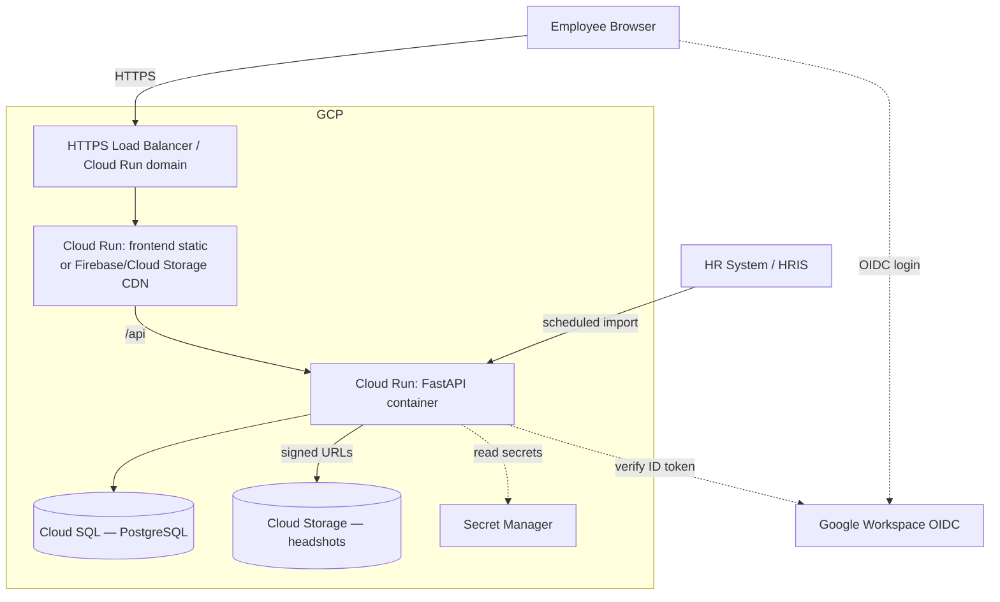
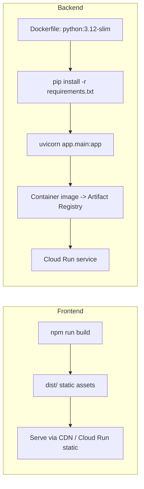

# Deployment — NameFaces Quiz

Local dev today; GCP as the target production topology.

| Field | Value |
|---|---|
| Doc version | 1.0 |
| Target cloud | GCP |
| Related | [ARCHITECTURE.md](ARCHITECTURE.md) |

---

## 1. Local development

```bash
# Backend (terminal 1)
cd backend
python3 -m venv .venv && source .venv/bin/activate
pip install -r requirements.txt
cp .env.example .env                 # SQLite + demo seed
ADMIN_EMAILS=you@griddynamics.com uvicorn app.main:app --reload --port 8000

# Frontend (terminal 2)
cd frontend
npm install
cp .env.example .env                 # VITE_API_URL=http://localhost:8000
npm run dev                          # http://localhost:5173
```

- Backend seeds 24 employees + demo leaderboard attempts on first run (idempotent — only when empty).
- Dev auth: any email logs in. Make yourself admin via `ADMIN_EMAILS`.
- SQLite file `backend/namefaces.db` persists between restarts; delete it to reseed.

## 2. Configuration

| Var | Side | Dev default | Prod |
|---|---|---|---|
| `DATABASE_URL` | backend | `sqlite:///./namefaces.db` | `postgresql+psycopg://…` (Cloud SQL) |
| `CORS_ORIGINS` | backend | `http://localhost:5173` | FE origin(s) |
| `QUIZ_LENGTH` / `TIMER_SECONDS` | backend | 8 / 15 | seed defaults (then DB `/config`) |
| `GOOGLE_CLIENT_ID` | backend | — | OIDC audience |
| `GOOGLE_HOSTED_DOMAIN` | backend | `griddynamics.com` | enforce workspace domain |
| `ADMIN_EMAILS` | backend | — | bootstrap admins (until group roles) |
| `SEED_ON_STARTUP` | backend | `true` | `false` |
| `VITE_API_URL` | frontend | `http://localhost:8000` | backend public URL |

Secrets (DB password, OIDC secret) → Secret Manager, injected as env at deploy.

## 3. Target topology (GCP)



## 4. Build artifacts



- **Frontend:** `npm run build` → static `dist/`. Host on Cloud Storage + CDN, Firebase Hosting, or a static Cloud Run service. Set `VITE_API_URL` at build time.
- **Backend:** containerize FastAPI (uvicorn/gunicorn workers), push to Artifact Registry, deploy to Cloud Run. Connect to Cloud SQL via the Cloud SQL connector.

## 5. Database lifecycle

- Dev uses `Base.metadata.create_all` at startup. **Production must use Alembic migrations** (`alembic upgrade head` as a deploy step / Cloud Run job).
- Set `SEED_ON_STARTUP=false` in production; load the real roster via HRIS import instead of demo seed.

## 6. Pre-production hardening checklist

- [ ] Replace dev `X-User-Email` stub with Google OIDC token verification (signature, `aud`, `hd`).
- [ ] Map Admin/Player from Workspace groups (retire `ADMIN_EMAILS` bootstrap).
- [ ] Validate quiz score server-side (do not trust client-sent score).
- [ ] Alembic migrations; `SEED_ON_STARTUP=false`.
- [ ] Real headshots in GCS; signed URLs; initials fallback for gaps.
- [ ] Restrict `CORS_ORIGINS` to the FE origin.
- [ ] Secrets in Secret Manager; least-privilege service accounts.
- [ ] Scheduled HRIS import (Cloud Scheduler → backend endpoint / job).
