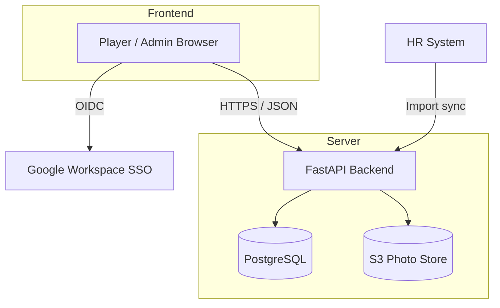
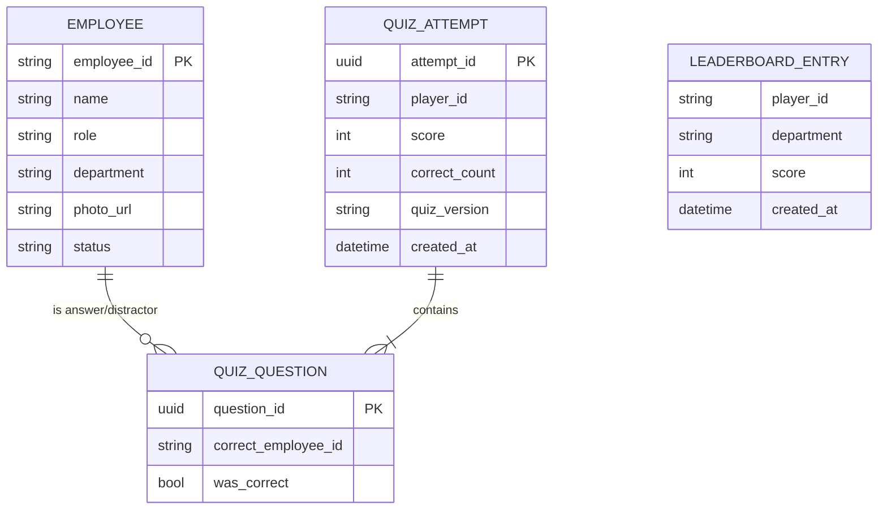
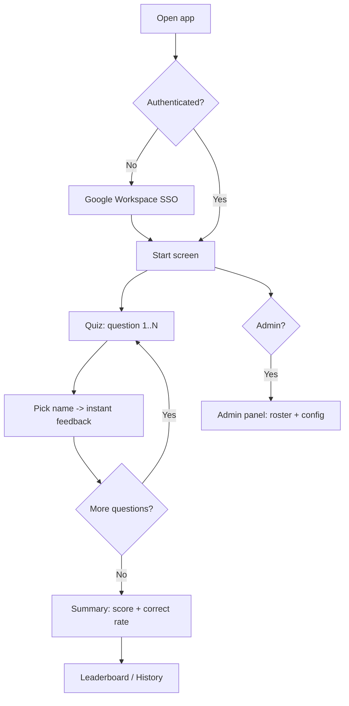

# Product Requirements Document — NameFaces Quiz

| Field | Value |
|---|---|
| Project | NameFaces Quiz |
| Doc version | 1.0 |
| Date | 2026-06-18 |
| Owner | edgar.velazq@gmail.com |
| Status | Draft — design only (no implementation) |

---

## 1. Overview

NameFaces Quiz is a light-hearted web app that helps office teams learn and remember colleagues' names and roles across the region. Each question pairs an employee headshot and job title with four name options — one correct, three distractors. Players answer one question per page, earn points, and compete on a persistent leaderboard that drives friendly, repeatable engagement.

## 2. Goals & Non-Goals

### Goals
- Help employees connect names to faces through quick, gamified sessions.
- Drive repeat play via scoring, leaderboards, and personal history.
- Give admins simple tools to keep the employee roster current.
- Ship a mobile-first, WCAG AA accessible experience.

### Non-Goals (initial release)
- Cross-company / multi-tenant support.
- Social sharing outside the org.
- Native mobile apps (web responsive only).
- ML-based distractor generation (using same-pool random — see §6.1).

## 3. Target Users & Roles

| Role | Description | Key actions |
|---|---|---|
| Player | Any authenticated employee | Take quizzes, view own score history, see leaderboards |
| Admin | HR / office manager | Curate roster, retire employees, configure quiz params |

Role assignment derives from Google Workspace group membership (see §7).

## 4. Success Metrics

- Weekly active players and repeat-play rate.
- Average correct rate trending up over time (recall improving).
- Leaderboard engagement: entries submitted, department coverage.
- Roster freshness: % active employees with valid photo + role.

## 5. User Stories

### Player
- As a player, I sign in with my company Google account and land on a quiz start screen.
- As a player, I see one headshot + role + four name options per page, and pick one.
- As a player, I get immediate correct/incorrect feedback after each answer.
- As a player, I see an end-of-quiz summary with total score and correct rate.
- As a player, I view a global top-10 leaderboard and filter it by department.
- As a player, I review my personal history: date, score, quiz version.

### Admin
- As an admin, employee photos and roles auto-populate from the HR system import.
- As an admin, I curate imported records — edit role/department, fix or replace photos.
- As an admin, I retire employees so they drop out of new quizzes.
- As an admin, I configure quiz parameters: number of questions and timing limits.

## 6. Functional Requirements

### 6.1 Dynamic quiz generation
- Generate randomized sets: 1 photo + 1 role + 4 name options per question.
- Exactly one correct name; three distractors drawn at random from the active employee pool (no similarity scoring in v1).
- No repeated correct-answer employee within a single quiz.
- Employees without a valid headshot are excluded from quizzes (never the correct answer or a distractor).
- Quiz length and per-question timing read from admin config.
- Each generated quiz records a `quiz version` for history/audit.

### 6.2 Gameplay & scoring
- One question per page, immediate feedback (correct / incorrect).
- Scoring: +10 correct, 0 incorrect.
- Per-question timer **on by default at 20s** (admin-configurable); timeout = incorrect.
- End-of-quiz summary: total score, correct count, correct rate.

### 6.3 Leaderboard & history
- Global leaderboard: top 10 across the company.
- Two windows: **weekly** (resets each week) and **all-time**.
- Tie-break: **earliest achieved** — first player to reach the score ranks higher.
- Department-filtered leaderboards.
- Personal history list: date, score, quiz version.

### 6.4 Administration panel
- View roster sourced from HR import; search/filter by department and status.
- Edit role/department, replace headshot, mark active/retired.
- Configure quiz parameters: question count, timing limits.
- Trigger or review HR import sync status.

### 6.5 HR system import
- Ingest employees from HRIS (CSV or API) — name, role, department, photo reference.
- Idempotent upsert keyed on a stable employee ID.
- Merge policy: **admin edits win** — manually edited records are flagged and never overwritten by re-sync.
- Employees missing a valid headshot are flagged but stay excluded from quizzes until a photo exists.

## 7. Authentication & Permissions

- SSO via **Google Workspace** (OIDC).
- Authenticated session required for all routes.
- Role-based access: Admin vs. Player, mapped from Google Workspace groups.
- Admin-only routes for the administration panel and quiz config.

## 8. Non-Functional Requirements

- **Responsive**: mobile-first layout.
- **Accessibility**: WCAG AA — color contrast, full keyboard navigation, alt text on headshots, focus states.
- **Performance**: quiz question load < 1s on broadband; images optimized/thumbnailed.
- **Privacy**: headshots + names are PII; access gated by SSO, retired employees excluded from new quizzes.
- **Auditability**: quiz version + timestamps stored per attempt.

## 9. Architecture (decided)

| Layer | Choice |
|---|---|
| Frontend | React + Vite (SPA) |
| Backend / API | Python FastAPI |
| Database | PostgreSQL |
| Photo storage | S3-compatible blob store |
| SSO | Google Workspace (OIDC) |
| Employee data source | HR system import (HRIS CSV/API) |
| Distractor logic | Same-pool random |
| Hosting | GCP — Cloud Run + Cloud SQL (Postgres) + GCS |

### 9.1 High-level data model (conceptual)

## 10. User Flows

## 11. Resolved Decisions

| Decision | Resolution |
|---|---|
| Hosting platform | **GCP** — Cloud Run + Cloud SQL (Postgres) + GCS. Pairs with Google Workspace SSO. |
| Leaderboard window | **Weekly + all-time** boards. |
| Leaderboard tie-break | **Earliest achieved** — first to reach the score ranks higher. |
| HR import merge policy | **Admin edits win** — flagged manual edits never overwritten by re-sync. |
| Per-question timer | **On by default, 20s**, admin-configurable; timeout = incorrect. |
| Missing headshot | **Exclude from quizzes** until a valid photo exists. |

### Remaining for v2
- **Distractor fairness** — same-pool random may surface easy/odd options; flag for v2 similarity scoring.

## 12. Release Scope

| Phase | Scope |
|---|---|
| MVP | SSO, quiz gen (same-pool random), scoring, summary, global leaderboard, HR import, basic admin curation |
| v1.1 | Department leaderboards, personal history, quiz config (count + timing) |
| v2 | Weighted/similarity distractors, period-based leaderboards, richer analytics |
